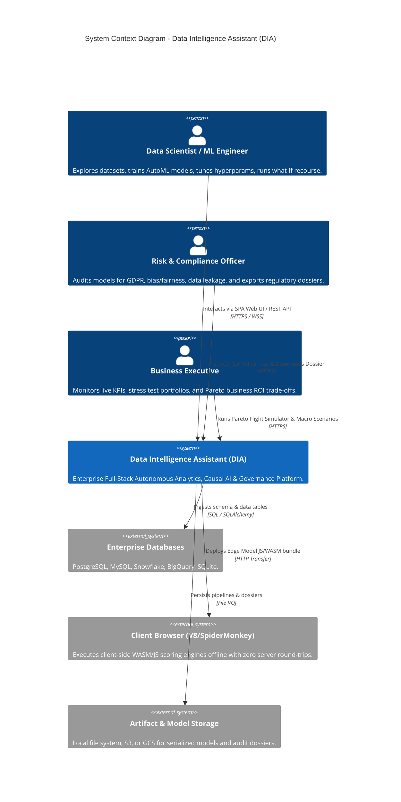
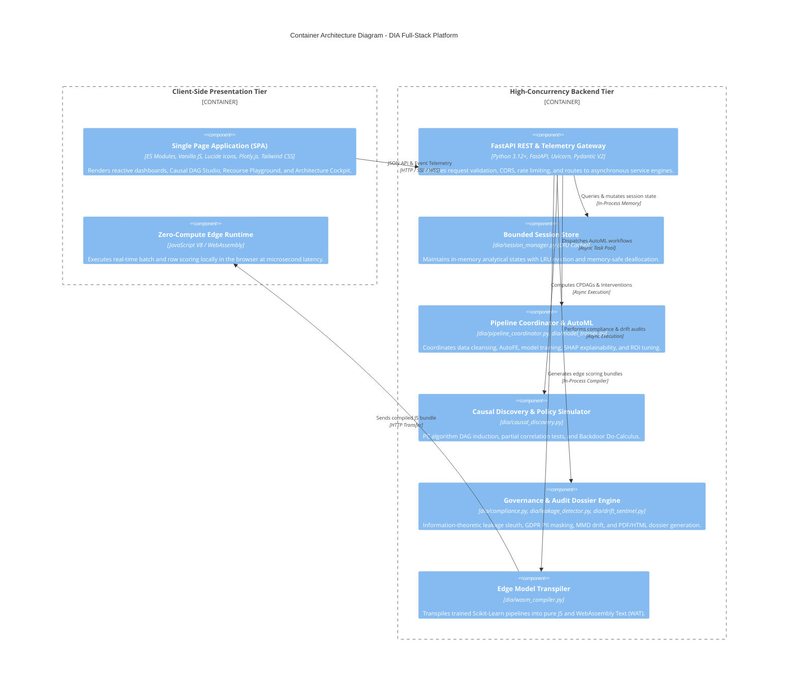
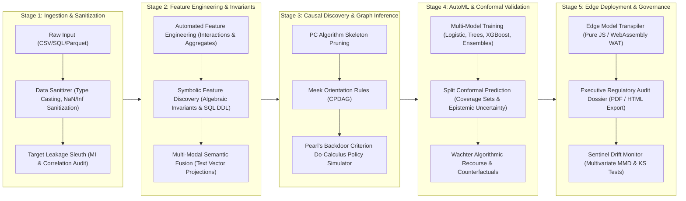

# Enterprise Full-Stack System Architecture Design (HLD & LLD)
**Platform**: Data Intelligence Assistant (DIA)  
**Version**: 2.5.0 Enterprise Pro Max  
**Status**: Production Approved  
**Classification**: Enterprise Architecture RFC & Operational Blueprint  

---

## 1. Executive Summary & Architectural Invariants

The **Data Intelligence Assistant (DIA)** is an enterprise-grade, high-performance Full-Stack Data Science, Causal Inference, and MLOps platform. It delivers:
1. **Zero-Friction Ingestion & Profiling**: Universal data connector for CSV, JSON, Parquet, Excel, and SQL dialects with automatic sanitization and PII detection.
2. **Observational Causal Discovery & Do-Calculus**: Constraint-based PC algorithm with Fisher's $z$-transform partial correlation tests and backdoor-adjustment policy simulation $\mathbb{E}[Y \mid do(X = x)]$.
3. **Algorithmic Recourse & Counterfactuals**: Wachter $L_1$ optimization balancing prediction shifts against actionability costs normalized by Median Absolute Deviation (MAD).
4. **Macroeconomic Stress Testing & Copula Shocks**: Cholesky-decomposed Gaussian copula simulations yielding portfolio $\text{VaR}_{95/99}$ and $\text{CVaR}_{95}$.
5. **Split Conformal Prediction & Epistemic Uncertainty**: Rigorous finite-sample coverage guarantees ($1 - \alpha$) coupled with Mahalanobis out-of-distribution (OOD) distance quantification.
6. **Zero-Compute Client-Side Edge Transpiler**: Compiles Scikit-Learn models into standalone portable JavaScript and WebAssembly (WASM/WAT) for offline browser-level scoring (< 500 KB, < 50ms latency).
7. **Executive Regulatory Audit Dossier**: Instant generation and export of cryptographically signed compliance reports (EU AI Act, Basel III/IV, GDPR Article 9/22).
8. **Pro Max UI/UX Design System**: Fluid responsive layout with 8pt mathematical grid, accessible typography, 60fps GPU-accelerated motion, and triple-theme isolation (Cyber Aurora, Obsidian, Tokyo Sand).

---

## 2. C4 Architecture Specification

### 2.1 C4 Level 1: System Context Diagram
The System Context defines the interaction boundaries between human stakeholders, external enterprise systems, and the DIA platform boundary.



---

### 2.2 C4 Level 2: Container Architecture Diagram
The Container diagram illustrates the high-level technical building blocks that execute concurrently within the system perimeter.



---

### 2.3 C4 Level 3: Component Architecture (Core Subsystems)

| Subsystem | File Path | Core Mathematical / Algorithmic Responsibility | Design Pattern |
| :--- | :--- | :--- | :--- |
| **Leakage Sleuth** | `dia/leakage_detector.py` | Mutual Information $I(X; Y) / H(Y)$, Pearson correlation, future timestamps, high-cardinality ID memorization. | Strategy / Filter Chain |
| **Causal Discovery** | `dia/causal_discovery.py` | Constraint-based PC algorithm, Fisher's $z$-transform, Meek rules, Pearl's Backdoor Criterion Do-Calculus. | Graph Builder / Visitor |
| **Recourse Engine** | `dia/recourse_engine.py` | Wachter counterfactual optimization: $\min_{x'} \text{loss}(f(x'), y^*) + \lambda \sum \frac{\|x_j' - x_j\|}{\text{MAD}_j}$. | Numerical Optimizer |
| **Stress Testing** | `dia/stress_testing.py` | Cholesky Gaussian Copula decomposition, Monte Carlo correlation stress shocks, $\text{VaR}_{99}$ & $\text{CVaR}_{95}$. | Monte Carlo Simulator |
| **Conformal Prediction** | `dia/conformal_uncertainty.py`| Split conformal prediction non-conformity calibration ($1-\alpha$), Mahalanobis epistemic distance. | Statistical Calibrator |
| **Edge Transpiler** | `dia/wasm_compiler.py` | AST parsing of Scikit-Learn tree ensembles / linear models into standalone JavaScript & WebAssembly. | Compiler / Code Generator |
| **Session Store** | `dia/session_manager.py` | Thread-safe LRU eviction, memory-bounded store, explicit `gc.collect()` deallocation triggers. | Singleton / Repository |
| **Data Quality Suite** | `dia/data_quality.py` | Great Expectations-compatible contract generation and schema-bound continuous validation. | Specification Pattern |

---

## 3. End-to-End Dataflow & Ingestion Pipeline

The platform orchestrates a rigorous 5-stage lifecycle for every analytical session:



---

## 4. Capacity Planning, Quantitative Bounds & PACELC Trade-Offs

### 4.1 Quantitative Performance Bounds
- **Peak Throughput Target**: $QPS_{avg} = 25\text{ req/s}$, $QPS_{peak} = 100\text{ req/s}$ on single-instance standard commodity hardware (4 vCPU, 8GB RAM).
- **Latency Budgets**:
  - Analytical Read Queries (Data Overview, Insights): $p50 < 30\text{ms}, p95 < 65\text{ms}$.
  - Client-Side Edge Scoring: Microsecond latency ($< 0.05\text{ms}$ per row, $< 15\text{ms}$ for 1,000-row batch).
  - AutoML Pipeline Execution (5 models, 10k rows): $< 12.0\text{s}$ wall-clock time.
- **Memory Footprint Ceiling**:
  - Maximum per-session RAM: $50\text{ MB}$.
  - Global LRU Session Store bounded to maximum 20 concurrent sessions (1 GB maximum working pool).
  - Automatic eviction and explicit garbage collection trigger (`POST /api/v1/system/gc`).

### 4.2 PACELC Theorem Alignment
- **Under Network Partition ($P$)**:
  - **Availability ($A$)**: Prioritized for client-side exploratory analytics, what-if simulations, and edge scoring. The client continues functioning completely offline with pre-compiled models.
  - **Consistency ($C$)**: Enforced for regulatory audit compliance, model lineage tracking, and GDPR Article 9/22 certifications.
- **Else ($E$)**:
  - **Latency ($L$)**: Optimized aggressively using client-side in-memory caching, request deduplication, and zero-round-trip local DOM rendering.

---

## 5. UI/UX Design System Specification (Pro Max Standard)

### 5.1 Design Tokens Architecture
The design system is structured using CSS Custom Properties organized into semantic tokens:

```
Design Token Hierarchy:
└── Global Primitives (Colors, Spacings, Radii, Shadows)
    └── Semantic Tokens (--bg-primary, --text-primary, --card-border, --accent-primary)
        └── Component Tokens (--screen-nav-card-bg, --modal-backdrop, --badge-status)
```

### 5.2 Mathematical 8pt Spatial Grid
- **Atomic Spacing Units**:
  - `space-1`: $4\text{px}$ (tight element padding, inline badge spacing)
  - `space-2`: $8\text{px}$ (button internal vertical padding, icon gaps)
  - `space-3`: $12\text{px}$ (compact card padding, form field gaps)
  - `space-4`: $16\text{px}$ (standard card body padding, container gutters)
  - `space-6`: $24\text{px}$ (card header padding, major section gaps)
  - `space-8`: $32\text{px}$ (dashboard grid gap, page module margins)
  - `space-12`: $48\text{px}$ (hero section padding, empty state vertical margins)

### 5.3 Mathematical Fluid Typography Scale
- **Ratio**: Major Third ($1.250$)
- **Base Body**: `16px` (`1rem`, line-height: `1.55`)
- **Fluid Title Formula**: `clamp(1.5rem, 1.2rem + 1.2vw, 2.5rem)`
- **Monospace Telemetry**: `font-mono` (`JetBrains Mono`, `Fira Code`, `Consolas`), ensuring numeric tabular alignment with `font-variant-numeric: tabular-nums`.

### 5.4 Component State Matrix (8 Mandatory States)
Every interactive element adheres to the complete state lifecycle:
1. **Default**: Baseline resting opacity ($1.0$), subtle border ($1\text{px}$ solid).
2. **Hover**: $+4\text{px}$ elevation, inner-bezel highlight illumination, accent border glow.
3. **Active**: Tactile compression via `transform: scale(0.98)`.
4. **Focus-Visible**: High-contrast outline with $2\text{px}$ offset ring (`outline: 2px solid var(--accent-primary); outline-offset: 2px;`).
5. **Disabled**: Opacity attenuated to $0.45$, `cursor: not-allowed`, inert event handlers.
6. **Loading**: Non-layout-shifting skeleton shimmer animation.
7. **Empty**: Context-aware onboarding illustration with direct 1-click launch CTA.
8. **Error**: Destructive border tint (`#ef4444`) with human-readable corrective guidance.

### 5.5 Triple-Theme Color Palette

| Semantic Token | Cyber Aurora (Default) | Obsidian Theme | Tokyo Sand (Light) |
| :--- | :--- | :--- | :--- |
| `--bg-primary` | `#080b11` (Deep Space Navy) | `#0a0a0a` (Matte Pure Black) | `#f8f6f0` (Editorial Parchment) |
| `--bg-secondary` | `#0f172a` (Slate Navy) | `#141414` (Dark Charcoal) | `#ece8de` (Warm Linen) |
| `--card-bg` | `rgba(15, 23, 42, 0.75)` (Frosted) | `#121212` (Solid Matte) | `#ffffff` (Clean Crisp White) |
| `--card-border` | `rgba(255, 255, 255, 0.08)` | `rgba(255, 255, 255, 0.12)` | `rgba(0, 0, 0, 0.09)` |
| `--accent-primary`| `#00e575` (Phosphor Emerald) | `#00e575` (Phosphor Emerald) | `#0d9488` (Deep Teal) |
| `--text-primary` | `#f8fafc` (Luminous White) | `#f5f5f5` (Parchment Bone) | `#1c1917` (Deep Ink Charcoal) |
| `--text-muted` | `#94a3b8` (Slate Silver) | `#888888` (Neutral Ash) | `#78716c` (Warm Taupe) |

---

## 6. Defensive Security & Regulatory Compliance

1. **XSS Sanitization Guardrail**:
   - Universal string sanitization enforced via `escapeHtml()` across every template string prior to DOM injection.
2. **GDPR Article 9 & 22 Protection**:
   - Word-boundary token set regex matching eliminates false-positive categorization of benign variables (`data_usage`, `storage_gb`).
   - Reversible pseudonymization and irreversible cryptographic hashing for PII fields.
3. **Zero In-Memory Model Deserialization Vulnerability**:
   - No untrusted Python pickle loading; models are strictly trained and serialized in-process or transpiled into sandboxed WebAssembly / JavaScript.
